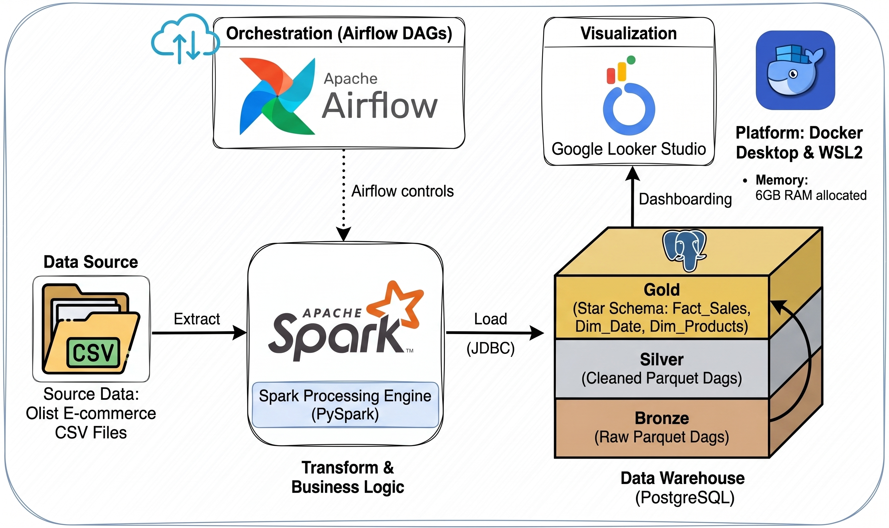

# Xây dựng Data Warehouse cho nền tảng thương mại điện tử Olist(Brazil) với Hệ sinh thái Big Data.

## 1. Giới thiệu về dự án
Dự án này tập trung vào việc xây dựng một hệ thống kho dữ liệu (Data Warehouse) cho nền tảng thương mại điện tử Olist (Brazil) sử dụng Hệ sinh thái Big Data. 
Mục tiêu là tự động hóa luồng xử lý dữ liệu để chuyển đổi hàng triệu dòng dữ liệu thô (từ các tệp CSV) thành các bảng dữ liệu tinh gọn, tối ưu, phục vụ cho việc phân tích kinh doanh chuyên sâu như: phân tích doanh thu, hành vi khách hàng, và hiệu suất giao hàng.

---
## 1.1 Kiến trúc dữ án


## 2. Cách hoạt động và Kiến trúc dữ liệu
Dự án được thiết kế theo chuẩn kiến trúc **Medallion Architecture**, sử dụng **Apache Spark** (PySpark) làm động cơ xử lý dữ liệu lớn cốt lõi và **Apache Airflow** để điều phối (orchestration) các luồng công việc tự động.

### 🏛️ Luồng xử lý qua 3 lớp dữ liệu (Medallion Architecture):
- **🥉 Lớp Bronze (Raw Data):** Dữ liệu thô (định dạng CSV) được đưa vào và lưu trữ lại dưới định dạng **Parquet** nhằm tối ưu hóa tốc độ đọc/ghi và tiết kiệm dung lượng. Dữ liệu ở lớp này được giữ nguyên 100% so với bản gốc.
- **🥈 Lớp Silver (Cleaned Data):** Dữ liệu từ lớp Bronze được làm sạch (Data Cleansing). Hệ thống sẽ xử lý các giá trị bị thiếu (Null/NaN), loại bỏ trùng lặp và chuẩn hóa các kiểu dữ liệu (chuyển đổi ngày tháng, chuỗi, số thực).
- **🥇 Lớp Gold (Business Level):** Dữ liệu đã sạch được tổ chức và mô hình hóa lại theo **Star Schema (Sơ đồ sao)**. Dữ liệu được chia thành các bảng Fact (Sự kiện kinh doanh) và các bảng Dimension (Chiều phân tích), sẵn sàng để kết nối trực tiếp với các công cụ BI (như PowerBI, Tableau) để lên Dashboard.

### 🛠️ Các công nghệ sử dụng (Tech Stack):
- **Xử lý dữ liệu lớn:** Python & PySpark (Apache Spark 3.5.x).
- **Điều phối quy trình (Orchestration):** Apache Airflow.
- **Lưu trữ dữ liệu:** Apache Parquet (Local file system / Hadoop Winutils).
- **Cơ sở dữ liệu Metadata:** PostgreSQL (Dành cho backend của Airflow).
- **Triển khai & Ảo hóa:** Docker & Docker Compose.

## 3. Cấu trúc thư mục của dự án

Dưới đây là cấu trúc thư mục chi tiết để bạn dễ dàng nắm bắt mã nguồn:

```
│
├── dags/                           # Thư mục chứa các kịch bản DAG của Airflow
│   └── olist_ecommerce_pipeline.py # Định nghĩa pipeline ETL (Raw -> Bronze -> Silver -> Gold)
│
├── dashboards/                     # Thư mục (hiện tại trống) dành cho các file báo cáo PowerBI/Tableau
│
├── data/                           # Thư mục chứa dữ liệu qua 4 giai đoạn xử lý (Medallion)
│   ├── raw/                        # Chứa file CSV gốc tải từ Kaggle
│   ├── bronze/                     # Dữ liệu thô đã chuyển sang định dạng Parquet
│   ├── silver/                     # Dữ liệu đã được làm sạch và chuẩn hóa kiểu
│   └── gold/                       # Dữ liệu Fact/Dimension (Sơ đồ sao) đã tổng hợp
│
├── docs/                           # Thư mục tài liệu bổ trợ
│   └── data_dictionary.md          # Từ điển mô tả chi tiết các trường dữ liệu
│
├── notebooks/                      # Thư mục (hiện tại trống) dành cho Jupyter Notebook EDA/Testing
│
├── sql/                            # Thư mục chứa các file truy vấn và định nghĩa SQL
│   ├── analytical_queries.sql      # Các câu truy vấn SQL mẫu để phân tích kinh doanh
│   └── ddl_star_schema.sql         # Câu lệnh tạo bảng (DDL) cho Star Schema (nếu đưa lên Database)
│
└── src/                            # Mã nguồn chính của dự án bằng PySpark
|   ├── __init__.py
|   │
|   ├── ingestion/                  # Quy trình nạp dữ liệu vào hệ thống
|   │   ├── __init__.py
|   │   └── raw_to_bronze.py        # Đọc CSV (Raw) và lưu lại thành Parquet (Bronze)
|   │
|   ├── transformation/             # Quy trình làm sạch và chuyển đổi (ETL)
|   │   ├── __init__.py
|   │   ├── bronze_to_silver.py     # Làm sạch dữ liệu, loại bỏ Null/Duplicate (Bronze -> Silver)
|   │   └── silver_to_gold.py       # Join dữ liệu, tạo bảng Fact và Dimension (Silver -> Gold)
|   │
|   └── utils/                      # Chứa các hàm dùng chung và tiện ích
|       ├── __init__.py
|       └── spark_session.py        # Hàm khởi tạo và cấu hình Apache Spark Session
├── config.yaml                     # File cấu hình đường dẫn và thông số hệ thống
├── docker-compose.yaml             # Cấu hình các dịch vụ Docker (Airflow, Postgres)
├── Dockerfile                      # File build Docker Image (chứa Airflow + PySpark)
├── requirements.txt                # Danh sách các thư viện Python cần thiết
├── README.md                       # Tài liệu chính của dự án
├── .gitignore                      # File cấu hình Git bỏ qua các file không cần thiết
├── .git/                           # (Thư mục ẩn của Git)
```

## 4. Hướng Dẫn Cài Đặt Và Chạy Dự Án (Dành Cho Người Mới)

Dự án này sử dụng **Docker** để tự động hóa việc cài đặt môi trường (Apache Airflow, PostgreSQL, PySpark). Nhờ đó, bạn không cần phải cài đặt cấu hình phức tạp trên máy tính cá nhân. 

### BƯỚC 1: Chuẩn bị công cụ và mã nguồn

**1. Cài đặt Docker Desktop (Bắt buộc):**
- Tải và cài đặt Docker Desktop
- Khởi động Docker Desktop và chắc chắn rằng icon Docker ở góc phải màn hình báo trạng thái **"Engine running"** (màu xanh).

**2. Cài đặt Git:**
- Tải và cài đặt Git

**3. Tải mã nguồn dự án về máy:**
Mở Terminal (Mac/Linux) hoặc Command Prompt / PowerShell (Windows) và chạy lệnh:
```bash
git clone https://github.com/xtoan289/ecommerce-bigdata-dwh.git
cd ecommerce-bigdata-dwh
```

### BƯỚC 2: Chuẩn bị dữ liệu thô (Raw Data)
Do dữ liệu gốc khá nặng nên sẽ không được đẩy lên Github. Bạn cần tải file dữ liệu thủ công:

1. Truy cập vào Kaggle: [Brazilian E-Commerce Public Dataset by Olist](https://www.kaggle.com/datasets/olistbr/brazilian-ecommerce)
2. Bấm nút **Download** để tải file `.zip` về máy.
3. Giải nén file `.zip` vừa tải.
4. Copy toàn bộ các file `.csv` bên trong và dán vào thư mục `data/raw/` của dự án (Nếu chưa có thư mục `raw`, hãy tự tạo nó theo đường dẫn `ecommerce-bigdata-dwh/data/raw/`).

### BƯỚC 3: Khởi chạy hệ thống bằng Docker
Tại màn hình Terminal đang đứng ở thư mục gốc `ecommerce-bigdata-dwh` (nơi chứa file `docker-compose.yaml`), chạy lệnh sau:

```bash
docker-compose up --build -d
```
- *Lệnh này sẽ mất vài phút trong lần chạy đầu tiên để tải các thư viện, hệ điều hành ảo và cài đặt Spark, Airflow.*
- *Tham số `-d` giúp hệ thống chạy ngầm để bạn có thể tiếp tục dùng terminal.*

### BƯỚC 4: Chạy luồng xử lý dữ liệu tự động (Pipeline)
Khi lệnh ở Bước 3 hoàn tất, hệ thống đã sẵn sàng:

1. **Truy cập Airflow UI:** Mở trình duyệt web (Chrome/Edge) và vào đường dẫn: 👉 `http://localhost:8080`
2. **Đăng nhập:** 
   - Tài khoản mặc định: `airflow`
   - Mật khẩu: `airflow`
3. **Kích hoạt luồng chạy:**
   - Trên màn hình chính, tìm DAG (luồng công việc) có tên là `olist_ecommerce_pipeline`.
   - Bấm vào **nút gạt (từ Pause sang Unpause - màu xanh)** ở bên trái tên DAG để kích hoạt.
   - Bấm vào biểu tượng **Nút Play (▶️) -> Trigger DAG** ở góc phải để ép luồng chạy ngay lập tức.
4. **Theo dõi tiến độ:** Bấm vào tên DAG, chuyển sang tab **Graph** hoặc **Grid** để xem dữ liệu chạy qua từng bước (Ingestion -> Silver -> Gold). Ô chuyển sang màu xanh lá cây đậm (Success) nghĩa là đã hoàn thành.

### BƯỚC 5: Kiểm tra kết quả
Sau khi Airflow chạy thành công toàn bộ, hãy mở thư mục dự án trên máy tính:
- Kiểm tra `data/bronze/`
- Kiểm tra `data/silver/`
- Kiểm tra `data/gold/`

Nếu xuất hiện các file/thư mục định dạng `.parquet` ở lớp `gold`, chúc mừng bạn đã cấu hình và chạy Data Warehouse thành công! Bạn có thể dùng PowerBI / Tableau kết nối trực tiếp vào thư mục `data/gold/` để vẽ biểu đồ phân tích.

### 🛑 BƯỚC 6: Tắt hệ thống khi không sử dụng
Chạy Docker ngầm sẽ tốn tài nguyên (RAM, CPU) của máy. Khi không làm việc với dự án nữa, bạn hãy tắt nó đi bằng lệnh:
```bash
docker-compose down
```
*(Lệnh này chỉ tắt dịch vụ chứ không làm mất dữ liệu bạn đã xử lý).*

---

### Mở rộng: Chạy trực tiếp bằng mã nguồn Python (Local testing)
Nếu bạn không muốn dùng Docker và chỉ muốn chạy script thủ công:
1. Cài đặt thư viện: `pip install -r requirements.txt`
2. Lần lượt chạy các file Python:
```bash
python src/ingestion/raw_to_bronze.py
python src/transformation/bronze_to_silver.py
python src/transformation/silver_to_gold.py
```
*(Yêu cầu máy tính phải cài sẵn Python 3.9+ và thiết lập Apache Spark/Hadoop Winutils hợp lệ).*